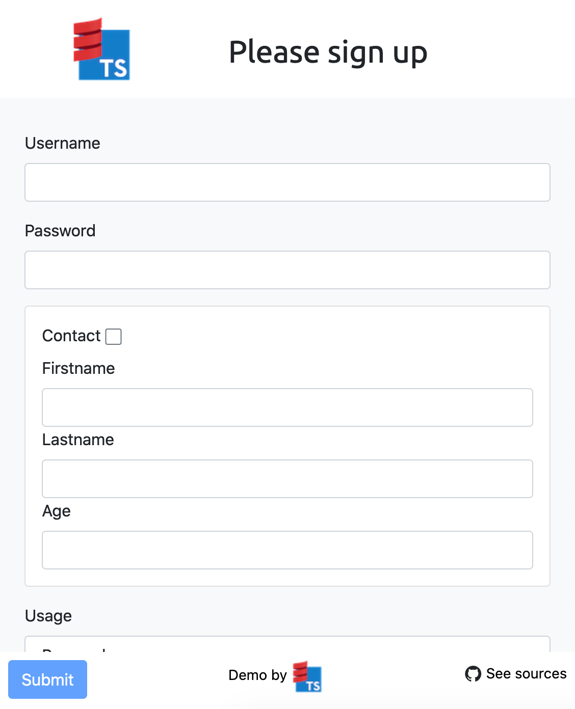
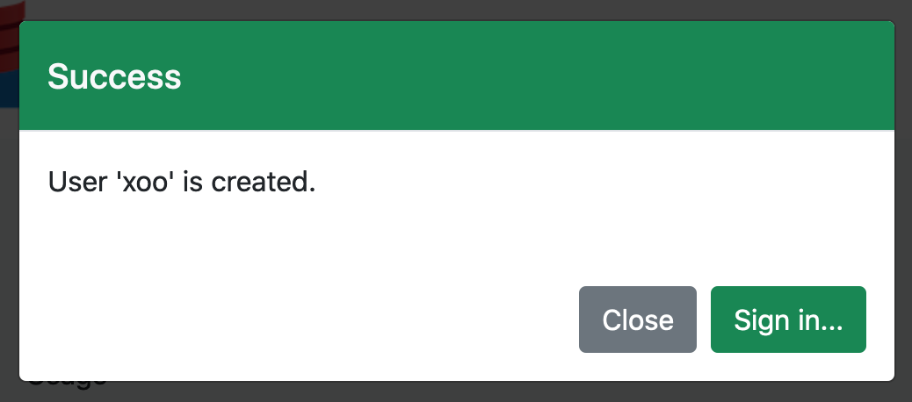
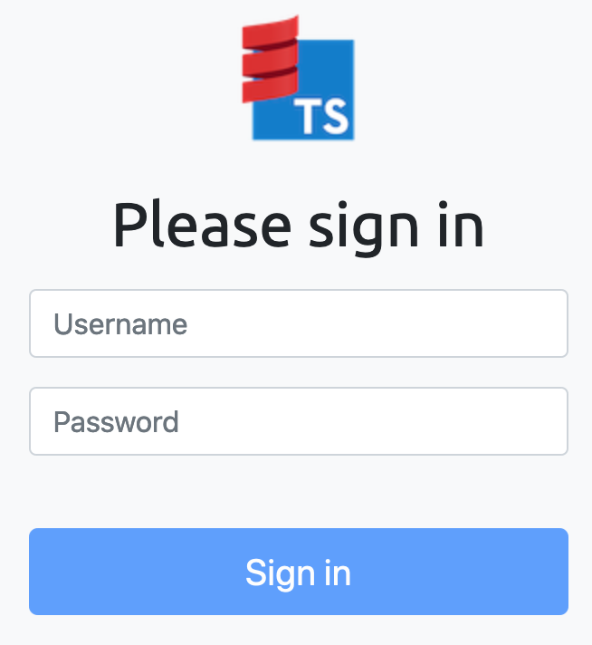
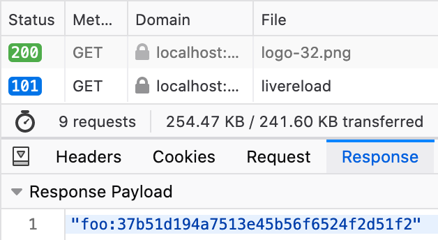
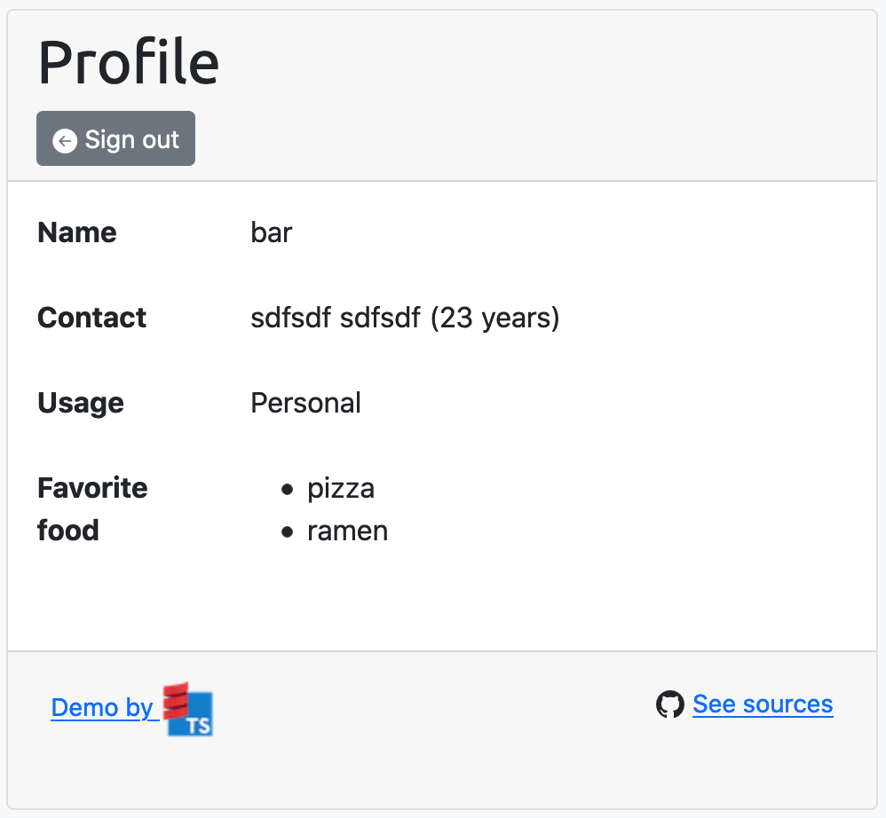
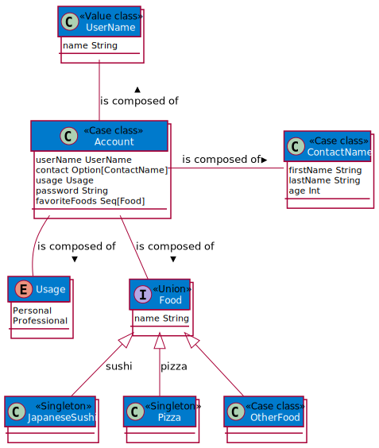

# Akka HTTP/Svelte demonstration

This is a *Scala-TS* demonstration with a REST API managing user information, and a TypeScript [SPA](https://en.wikipedia.org/wiki/Single-page_application) as frontend for this API.

The Scala API is developed using [Akka HTTP](https://doc.akka.io/docs/akka-http/current/index.html), while the TypeScript frontend is based on [Svelte](https://svelte.dev/).

This sample project will demonstrate how to share the [data model](#model) between the Scala REST API and the TypeScript frontend in such situation.

> See [sources on GitHub](https://github.com/scala-ts/scala-ts/tree/demo/akka-http-svlete)

> Try it [on Heroku](https://scala-ts-demo.herokuapp.com/)

## Use cases

The application demonstrates several user management features.


### Signup

The user can create a new account.

First, the user signs up using the Svelte form.



Then the frontend `POST`s as JSON the TypeScript `Account`.

e.g.

```json
{
  "userName": "xoo",
  "password":"bar",
  "usage":"Personal",
  "favoriteFoods": [
    "pizza",
    { "name": "ramen" }
  ],
  "contactName": {
    "firstName": "Lorem",
    "lastName": "Ipsum",
    "age": "23"
  }
}
```


> *See [TypeScript POST](https://github.com/scala-ts/scala-ts/blob/demo/akka-http-svlete/frontend/src/screens/signup/signup.ts#L58)*

The REST API receives the JSON data and decodes it as [Scala `Account`](https://github.com/scala-ts/scala-ts/blob/demo/akka-http-svlete/common/src/main/scala/Account.scala#L3).

> *See [Scala SignUp endpoint](https://github.com/scala-ts/scala-ts/blob/demo/akka-http-svlete/http-api/src/main/scala/Router.scala#L38)*

> *Note:* [Play JSON](https://github.com/playframework/play-json#play-json) is used to read and write the Scala types from/to JSON requests/responses.

If it's Ok, the [Scala `UserName`](https://github.com/scala-ts/scala-ts/blob/demo/akka-http-svlete/common/src/main/scala/Account.scala#L11) is [sent back as JSON](https://github.com/scala-ts/scala-ts/blob/demo/akka-http-svlete/http-api/src/main/scala/Router.scala#L99) response.


Finally, frontend handles the response as TypeScript `UserName`, and the Sign Up confirmation is displayed (or error if some).



> *Note:* In this sample frontend, it's possible to 'quite' safely [assert the JSON response as the expected type](https://www.typescriptlang.org/docs/handbook/basic-types.html#type-assertions). In many case, validating the response must be done (e.g. [io-ts](https://gcanti.github.io/io-ts/), [idonttrustlikethat](https://scala-ts.github.io/scala-ts/#idonttrustlikethat), ...).

### Login

The user can connect using his credentials, and then see his information on the profile screen.

First, the user type his name and password.



Then the frontend `POST`s as JSON the TypeScript `Credentials`.

```json
{"userName":"foo","password":"bar"}
```


> *See [TypeScript login](https://github.com/scala-ts/scala-ts/blob/demo/akka-http-svlete/frontend/src/screens/signin/signin.ts#L36)*

The REST API receives the JSON data and decodes it as [Scala `Credentials`](https://github.com/scala-ts/scala-ts/blob/demo/akka-http-svlete/common/src/main/scala/Account.scala#L46).

> *See [Scala SignIn endpoint](https://github.com/scala-ts/scala-ts/blob/demo/akka-http-svlete/http-api/src/main/scala/Router.scala#L51)

If it's Ok, a [user token](https://github.com/scala-ts/scala-ts/blob/demo/akka-http-svlete/http-api/src/main/scala/Router.scala#L109) is sent back as JSON response.



Then the frontend [redirects to the profile screen](https://github.com/scala-ts/scala-ts/blob/demo/akka-http-svlete/frontend/src/screens/signin/signin.ts#L92), which `GET`s its information (according the token passed as [HTTP authentication](https://developer.mozilla.org/en-US/docs/Web/HTTP/Authentication)).

The REST API handles the user token, and finds the corresponding Scala `Account` to send it back as JSON.

```json
{
  "userName": "foo",
  "usage": "Personal",
  "password": "bar",
  "favoriteFoods": [ "pizza", "ramen" ]
}
```

Finally, the frontend receives the response as TypeScript `Account`, and it's displayed on the profile screen.



## Model

The demonstration models the user accounts and related information (username, credentials and token).



| Scala                  | TypeScript            |
| ---------------------- | --------------------- |
| Account case class     | Account interface     |
| UserName value class   | string                |
| Credentials case class | Credentials interface |
| UserToken value class  | string                |

## Project structure

The demonstration project is composed of multiple modules.


**common:** Common data model

Using *Scala-TS*, it declares the data model as Scala types, and from there the corresponding TypeScript types are generated.

```ocaml
lazy val common = (project in file("common")).
  enablePlugins(TypeScriptGeneratorPlugin).
  settings(
    Seq(
      name := "scala-ts-demo-common"
    ) ++ scalatsUnionWithLiteral)
```

**http-api** REST/HTTP API

Implements the use cases based on the data model

**frontend** TypeScript Svelte frontend

## Build

Using [SBT](https://www.scala-sbt.org/):

1. Run `sbt common/compile` to compile the Scala data model, and generate the corresponding TypeScript (to `common/target/scala-ts/src_managed/`).
2. Run `sbt http-api/compile` to compile the REST API.

Since *#1* is ok, the TypeScript/Svelte frontend can be built (using the generated TypeScript).

```bash
cd frontend
yarn build
```

## Deploy

It can be deploy to [Heroku](https://www.heroku.com/) using Docker build.

- [`heroku.yml`](https://github.com/scala-ts/scala-ts/blob/demo/akka-http-svlete/heroku.yml)
- `Dockerfile` ([copy frontend](https://github.com/scala-ts/scala-ts/blob/demo/akka-http-svlete/Dockerfile#L12) to `src/main/resources/webroot` so it's served as static resources).
